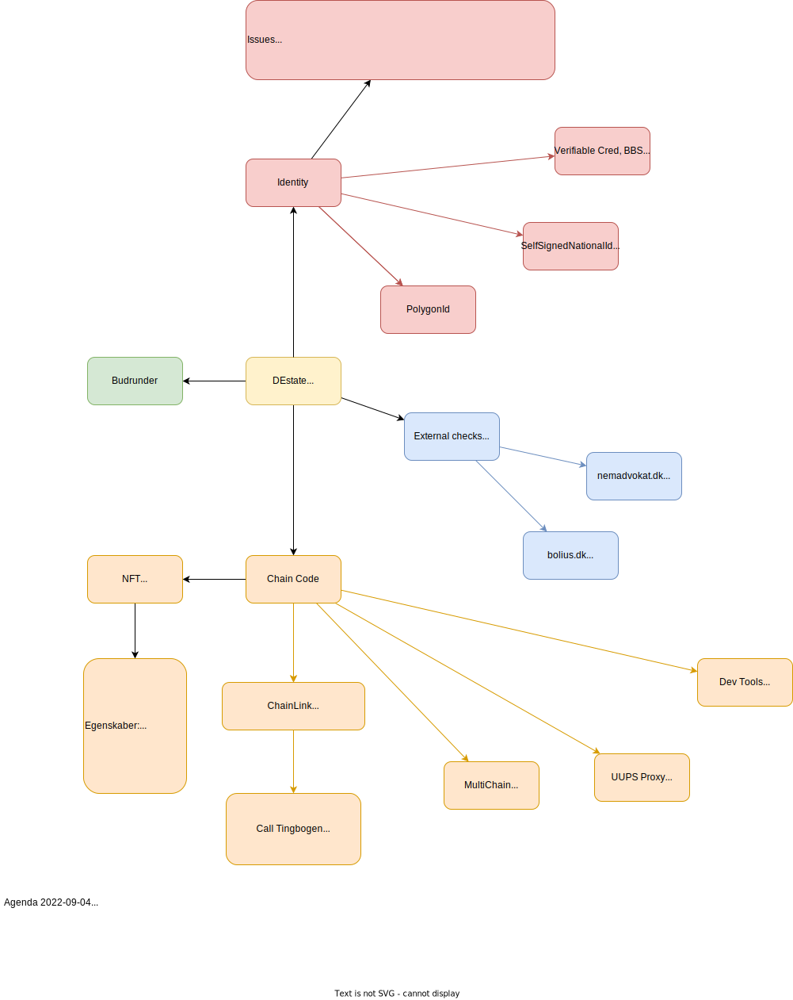

# Features
Features:
 - Mint NFT:
   - Minimum krævede egenskaber/oplysninger
    - Authentificering af sælger med mindst public identity service (MitID) 
    - Validering af sælger på Tingslysningskontor
    - Sælgers blockchain adresse
   - Alternativer egenskaber
    - Validering af sælger med pas
 - Budrunder:
   - lukkede/åbne
   - periode

## Mindmap
  
_Mind map of DEstate todos/features_  