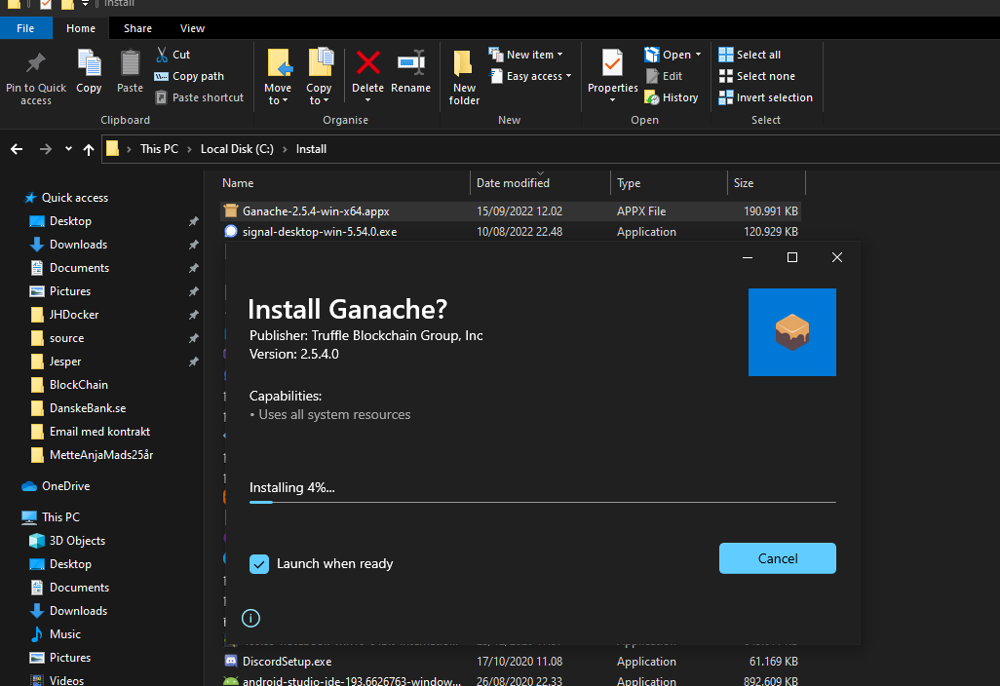
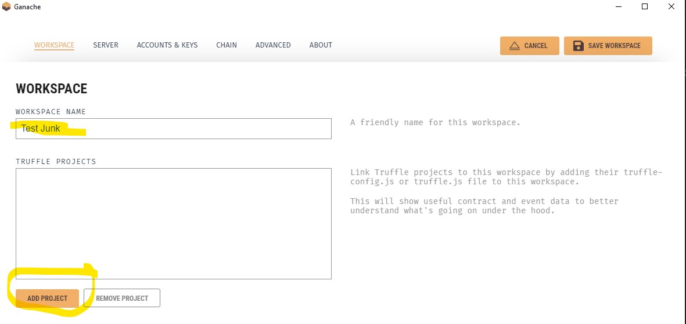
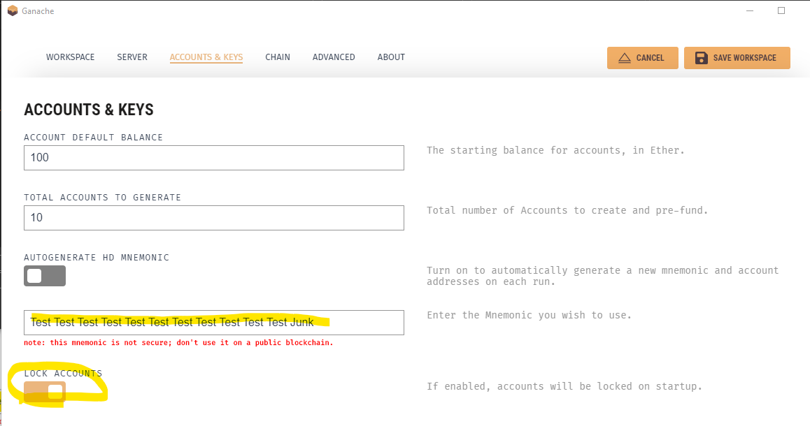

# Installation guide
 ## Truffle suite
  - [Home - Truffle Suite](https://trufflesuite.com/)
  - [Direct download Ganache
ONE CLICK BLOCKCHAIN UI ](https://github.com/trufflesuite/ganache-ui/releases/download/v2.5.4/Ganache-2.5.4-win-x64.appx)
- Installer: 
- New Workspace: 
- Mnemonic: 
## IPFS  
- chokolatey Powershell install
 ```ps
Set-ExecutionPolicy Bypass -Scope Process -Force; [System.Net.ServicePointManager]::SecurityProtocol = [System.Net.ServicePointManager]::SecurityProtocol -bor 3072; iex ((New-Object System.Net.WebClient).DownloadString('https://community.chocolatey.org/install.ps1'))
```
- IPFS
```bash
#choco install go-ipfs #probably not needed
choco install ipfs-desktop
ipfs --version
ipfs init
#generating ED25519 keypair...done
#peer identity: #12D3KooWCfxVP6mwa5HL8dQ3veqVpnUMCDP5PoFe3WnEmSTctGQ1
#initializing IPFS node at C:\Users\Jesper\.ipfs
#to get started, enter:
 ipfs cat /ipfs/QmQPeNsJPyVWPFDVHb77w8G42Fvo15z4bG2X8D2GhfbSXc/readme
ipfs daemon --offline
```
```json
// Set cors in 
// -ipfs/config.
#
  "API": {
    "HTTPHeaders": {
      "Access-Control-Allow-Methods": [
        "PUT",
        "GET",
        "POST"
      ],
      "Access-Control-Allow-Origin": [
        "*"
      ]
    }
  },
```
## truffle
- Install
```bash
npm install -g windows-build-tools
nvm install 14.20.0
nvm use 14.20.0
npm install truffle -g
```
Run web servier
```bash
http://localhost:3000
```


